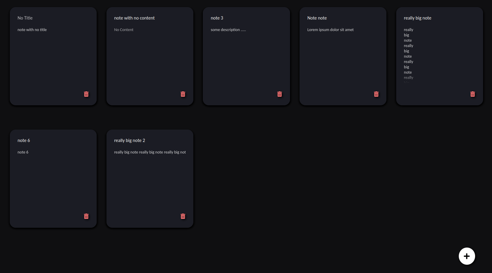

# Notes app



Uma aplicação web simples para escrever notas feita com React, Express e MySQL.

## Objetivo

O objetivo é ter uma aplicação para se fazer anotações com persistência em banco de dados.

## Rodando

Baixe o código:

```bash
git clone https://github.com/gammag4/notes_app
```

Configure o MySQL:

```bash
sudo apt install mysql-server
sudo mysql -e "CREATE USER 'username'@'localhost' IDENTIFIED WITH caching_sha2_password BY 'password';"
sudo mysql -e "CREATE DATABASE notes_db;"
sudo mysql -e "GRANT ALL PRIVILEGES ON notes_db.* TO 'username'@'localhost';"
sudo mysql -e "FLUSH PRIVILEGES;"
mysql -u gabriel -p notes_db < notes-backend/create_database.sql
```

Crie o arquivo `.env` em notes-backend com essa estrutura:

```bash
DB_HOST=localhost
DB_USER=your_user
DB_PASS=your_password
DB_NAME=notes_db
```

Rode tanto o front e backend e acesse o app pelo endereço `http://localhost:3000/`:

```bash
cd notes-backend && yarn start
```

```bash
cd notes-app && yarn start
```

## Funcionalidades

- Ver notas
- Salvar nova nota
- Editar nota
- Remover nota
